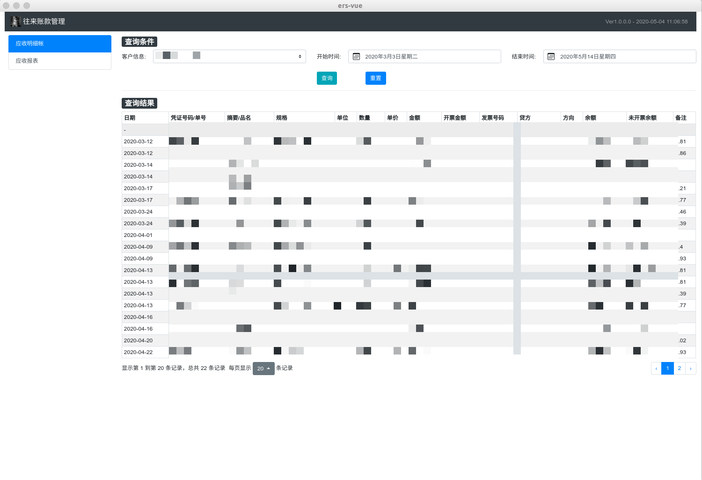

## ers
  - 读取`ers-electroon/resource/hello.xlsm`的内容并计算金额显示到app中.

## 实现思路
  - ers-vue
    + 使用`vuecli3`打包`spa`页面
   
  - ers-electron
    + 引入`express`模块, 实现`server.js`中的http接口 
    + `electron`启动的时候加载`ers-vue`打包好的`dist`中的`index.html`
    + `index.html`中请求数据接口为`server.js`提供

## 使用
  - ers-vue
  ```
    cd /ers-vue
    npm install
    
    npm run build             # 打包成dist
  ```

  - ers-electron
  ```
    cd /ers-elctron
    npm install
    
    cp -r ../ers-vue/dist .   # 拷贝ers-vue打包好的dist到当前目录的ers-electron中
    npm start                 # 启动electron-app
    npm run build-window      # 编译window版本
  ```

## 截图
  


## 其他
  - `electron`打包的时候需要配置`npm config set`设置成`淘宝`镜像.
    
